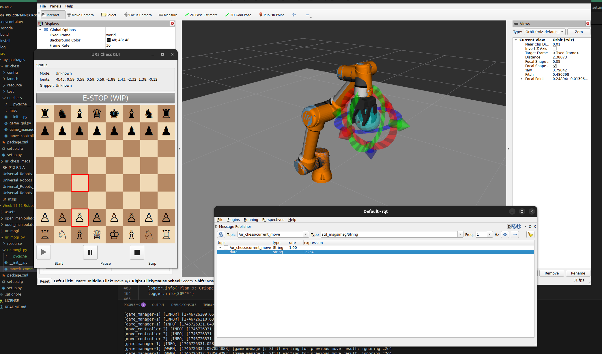

# UR5E robot plays chess - ROS2 implementation

### TODOS:
- [x] Make Stockfish chess node
- [x] Make a world with chess scene
  - [x] Make it dynamic with params
  - [x] Fix (?) arm speed issue : increase velocity and acc factors in cpp.yaml
- [x] Make moveit controller
  - [x] Refine controller with moveit_py
- [x] Make estop in gui
- [x] Setup driver and gazebo for the [RH-P12-RN-A](https://github.com/ROBOTIS-GIT/RH-P12-RN-A) gripper
- [x] Add collision geometry for RVIZ
  - [x] Fully sync with gazebo params (same .yaml)
- [ ] Refine code
  - [ ] Fix game controls (~~play~~, pause, stop)
  - [ ] Better error handling, (make a reset button)
  - [ ] Config for constraints, maybe dynamic based on borad loc.
  - [x] Handle en passant, checkmate
- [x] Make it playable with gui?
  - [ ] PvP, PvAI, AIvAI
- [ ] Update README
- [ ] **Test driver on real life robot**
  - [ ] Make grabber control interface for ROS2

**People on the project**
- Márk **Bancsi**
- Zsombor **Ménes**
- Xiang **Wang**
- Bercel **Papp**

## Pre-requisites
- Ubuntu 24 (native or WSL)
- Nvidia GPU with driver
- VSCode

## Pre-Installation 

>[!IMPORTANT]
>This project uses a docker enviroment to run ROS2 and any dependencies, so installation of Docker is strongly suggested.
> *You can fish out the necessary pacakges for it to run from the Dockerfile of course...*

### Docker

Install docker: https://docs.docker.com/engine/install/ubuntu/

And perform the post-install step following the link at the bottom of the page:

```bash
sudo groupadd docker
```

```bash
sudo usermod -aG docker $USER
```
You should log out and log in again to update the user groups!

Use **VSCode** for easier acces. Install these extensions:
- Devcontainer
- Docker
- Remote - SSh (*may not be needed*)

### NVIDIA Container

To fully utilize the graphics card inside the container we need this. Note that some examples will work without it, but most of them benefit from it!

Follow the installation steps here:
https://docs.nvidia.com/datacenter/cloud-native/container-toolkit/install-guide.html#docker


## Running the container

Once you have installed Docker, simply run these following scripts:

```bash
cd /docker
./build_docker.sh
```

If the Dockerfile was succesfuly built, start the container with:

```bash
cd /docker
./run_docker.sh
```

If you don't have nvidai GPU on your system, remove the lines --gpus=all and --runtime nvidia from the run script, but bevare the simulation software will chug your pc.

Sometimes Docker won't see the nvidia runtime, so we need to edit the docker daemon manually.
```bash
sudo nano /etc/docker/daemon.json
```
And include the following:
```bash
{
  "runtimes": {
    "nvidia": {
      "path": "nvidia-container-runtime",
      "runtimeArgs": []
    }
  },
}
```

>[!TIP]
>If you run into any other problems, feel free to ask or just open an issue

Once the container has been created, go to the **Docker** tap in vscode -> right click the running container -> attach VSCode.

Open the ros2_ws folder, that will be the workspace folder, where you can build.
>[!IMPORTANT] 
> Only colcon build in this folder to circumvent any issues!

## Running the UR driver (with the gripper attached)
Once you are inside the container, you can start running drivers and writing you code.

The full documentation about the UR driver and its packages can be found [here](https://docs.universal-robots.com/Universal_Robots_ROS2_Documentation/index.html).

### Simulation

To run the sim with moveit and gazebo: 
```bash
ros2 launch ur_simulation_gz ur_sim_moveit.launch.py ur_type:=ur5e
```

Next launch the chess simulation:
```bash
ros2 launch ur_chess ur_chess.launch.py
```

Right now the only the arm movement works, in an empty space. On the provided GUI however, you can observe the current hypotethical chess game.



The game manager waits for a new move on the topic `/ur_chess/current_move` in the [UCI](https://en.wikipedia.org/wiki/Universal_Chess_Interface) format, and when the robot finishes plaing the piece into the new pos it updates the current chessboard state in [FEN](https://en.wikipedia.org/wiki/Forsyth%E2%80%93Edwards_Notation) format on `/ur_chess/chessboard_state`

### World generation

To adjust wolrd based on the position of A1 and tile size modify the `generate_chess_sdf.py` as needed at `~/my_packages/chess_gazebo_world/chess_gazebo_world/generate_chess_sdf.py`.

Then run
```bash
ros2 run chess_gazebo_world generate_chess_sdf 
```

Rebuild the workspace (if needed) before **and/or** after world generation and launching.

```bash
colcon build
source install/setup.bash
```

### Real-life
- TBD