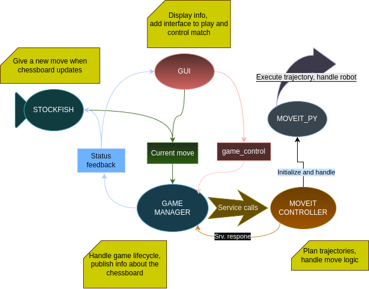

# UR5 Chess ROS 2 — Documentation

  

This documentation covers our university project, which involved converting the original [ROS 1 version of UR5 Chess](https://github.com/MOGI-ROS/ROS_Chess) to ROS 2.

During development, we quickly realized that a straightforward migration was not feasible. Due to significant architectural and API changes in ROS 2, much of the original codebase was incompatible. As a result, we opted to rebuild the system from the ground up.

---

## Project Environment

To ensure portability and minimize compatibility issues, we used **Docker**. This approach allowed us to avoid installing third-party packages and drivers directly into the repository. For convenience, we created scripts to handle building and running the container.

---

## Third-Party Packages

Before diving into our custom packages, we would like to acknowledge [**DanielBrenn**](https://github.com/DanielBrenn) for his contributions. His modifications to the UR driver made it possible to control the [RH-P12-RN-A gripper](https://github.com/ROBOTIS-GIT/RH-P12-RN-A) in both Gazebo and MoveIt, and his general support throughout the project was invaluable.

---

## Project Structure

The system is orchestrated by the **game manager** node. It processes the current board state and robot status, handles incoming messages, and validates moves. Once a move is verified, the game manager delegates execution to the MoveIt controller. It also publishes feedback such as the game state in [FEN](https://www.chess.com/terms/fen-chess) format or the last move in [UCI](https://en.wikipedia.org/wiki/Universal_Chess_Interface) notation. Most decision-making and external interfaces are centralized here to ensure consistent message flow.

The **GUI node** handles user interaction and provides feedback through an interactive, clickable chessboard. It supports **AI vs AI**, **PvP**, and **Player vs AI** modes with selectable sides. The GUI manages turn-based control, disabling input when it’s not the player’s turn.

The **Stockfish node** receives FEN strings and responds with UCI moves. It adapts to the selected game mode—for example, it disables itself in **PvP** mode and only plays when it’s the AI’s turn in other modes.

The **MoveIt controller** wraps around `moveit_py`, which itself is a Python interface to the underlying MoveIt C++ libraries. This node translates UCI move commands into executable trajectories and sends them to the robot. It also handles special cases like castling and piece captures.

---

For a deeper dive into each ROS 2 node and its internal workings, see the [ros2_nodes](./ros2_nodes) section.
