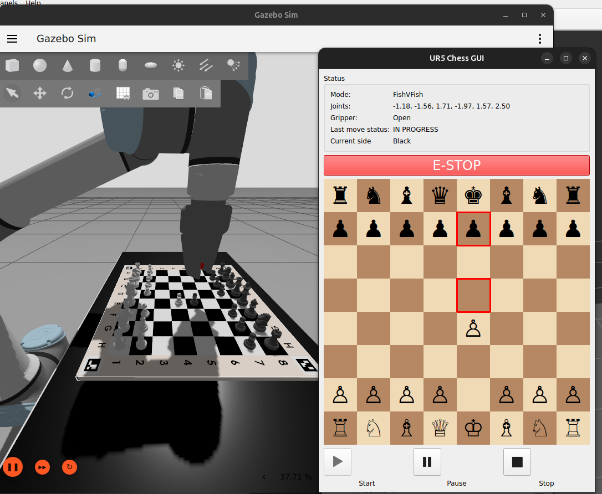

# Nodes and Interfaces of UR_Chess

## Core Dependencies

In addition to ROS 2, the project relies on several key packages:

- **UR ROS 2 Driver** (with gripper support): Provides real and simulated control of the UR5 arm and RH-P12-RN-A gripper. See [Introduction](index.md) for more.
- **MoveIt & moveit_py**: Used for motion planning and trajectory execution.
- **[python-chess](https://python-chess.readthedocs.io/en/latest/)**: A Python library that manages the game logic, including move validation, board state updates, and FEN/PGN parsing. It’s an essential component for managing chess rules.
- **[stockfish](https://pypi.org/project/stockfish/)** Python wrapper: Used to configure and interact with the Stockfish engine from Python.

---

## Nodes

### Game Manager

The **Game Manager** is the central coordinator of the system. It enforces the rules, tracks game state, and mediates communication between nodes.

- It listens on the `/game_control` topic for a command to start a new game, which moves the UR5 to its initial position.
- Once initialized, it listens on `/current_move` for player or chess moves.
- Moves are validated using a `python-chess` `Board` instance. Invalid moves (e.g. wrong turn, illegal move, in-check) are rejected.
- Validated moves are forwarded to the MoveIt controller, and the system enters an "in progress" state, during which new moves are ignored.
- When a move finishes successfully, it is committed to the game board and the updated FEN is published on `/chessboard_state`.
- During each state change, the state of the move is published `/move_status`. This topic is mostly for debugging, and for the GUI feedback and flow controtl.

Although Stockfish usually generates legal moves, this validation layer ensures robustness—especially in user-controlled modes.

---

### Moveit controller

The **MoveIt Controller** wraps the `moveit_py` API, enabling trajectory planning and execution with collision checking. It requires the UR simulation to be running and connected.

- Upon receiving a move request, the controller decodes it and handles special moves (e.g. **castling** or **captures**) by splitting them into appropriate sub-actions.
  - For example, in castling, the rook is moved before the king, even if the UCI command refers to the king only.
- The chessboard and all pieces are dynamically managed in the **Planning Scene Monitor** to reflect their current positions.
  - For simplicity, each piece is represented as a cylinder for collision avoidance purposes.

  

Although the controller was initially designed for full asynchronous operation—planning all individual motions ahead of time and executing them in sequence—this approach turned out to be impractical due to the complexity of real-time scene updates and hardware timing constraints.

Instead, we implemented a **semi-synchronous execution model**:

- Each pick-and-place operation (i.e. a chess move) is broken into **three distinct phases**:
  1. **Grasping** the selected piece.
  2. **Transporting** the piece to the destination.
  3. **Releasing** the piece.

- Between each phase, we update the **planning scene** to reflect changes:
  - When grasping, the piece is attached to the robot in the scene.
  - When releasing, the piece is detached and added back to the board as a static object.

This stepwise structure allowed us to:
- Dynamically manage the scene for collision-aware planning.
- Simplify coordination with the Game Manager.
- Avoid planning errors due to outdated collision objects.

While not fully parallel or pipelined, this approach strikes a balance between safety, control, and responsiveness—critical for handling precise manipulations in a constrained space like a chessboard.

### Graphical Interface (GUI)

The original ROS1 version lacked a full graphical interface, but for a system like this, having clear control and visual feedback is essential. We implemented the GUI using **PyQt5**, a robust and well-supported toolkit for desktop applications.

  

Through the GUI, users can start or stop the game as described in the Game Manager node. By changing game modes -  **AI vs AI**, **Player vs AI**, or **Player vs Player** - in the launchfile, the GUI use changes from just feedback to a full playable game interface. Inputs are only accepted when it's the player's turn; otherwise, interaction is disabled to prevent invalid or conflicting actions.

In Player vs AI or PvP mode, users can select and move pieces on the board. In the case of illegal move, the game managger will resend an error message what was wrong about it. The GUI also provides visual feedback, including pop-up messages for check and checkmate—though these are disabled during the AI’s turn to avoid clutter.

> **Note:** Due to ROS’s distributed nature, it’s technically possible to launch two GUIs on different devices within the same ROS network for PvP games. While this setup was tested and functional, full integration for a seamless experience remains a future goal.

---

### Stockfish Node

  

This node runs the chess AI using the [Python Stockfish package](https://pypi.org/project/stockfish/). At startup, the engine is dynamically downloaded via Docker, and its behavior can be fine-tuned using parameters such as **Skill Level**, **Contempt**, or **Depth** (e.g., to adjust how aggressively it plays or how deep it searches).

The node subscribes to the `/chessboard_state` topic. Upon receiving a FEN string, it passes it to the engine and retrieves the best move. Thanks to the compact nature of FEN, the full board state—including whose turn it is—is preserved without needing additional context.

When the game is in **PvP mode**, the node shuts down immediately on launch, as no AI is needed. In **Player vs AI**, it only computes and publishes moves when it's the AI’s turn.
